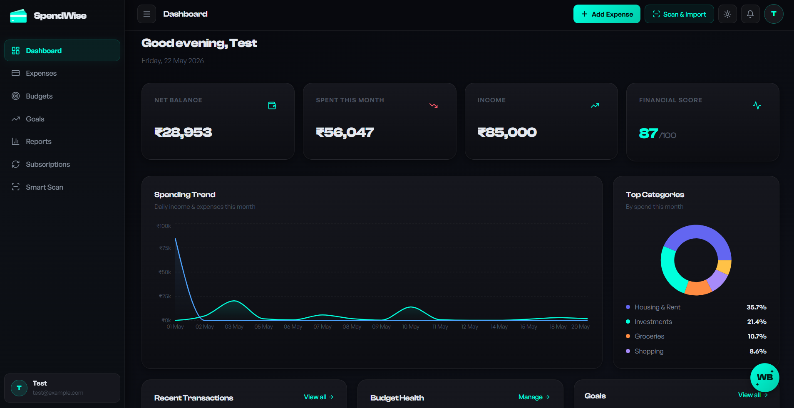
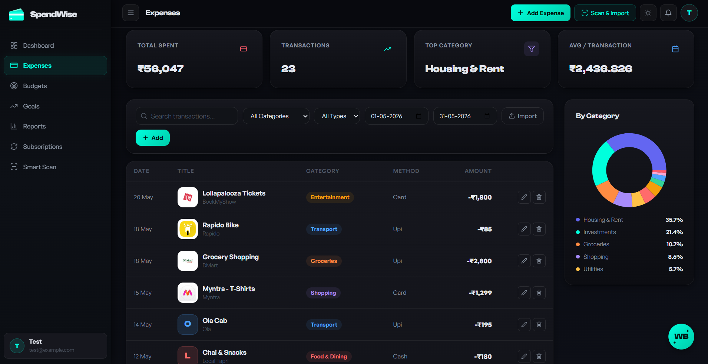
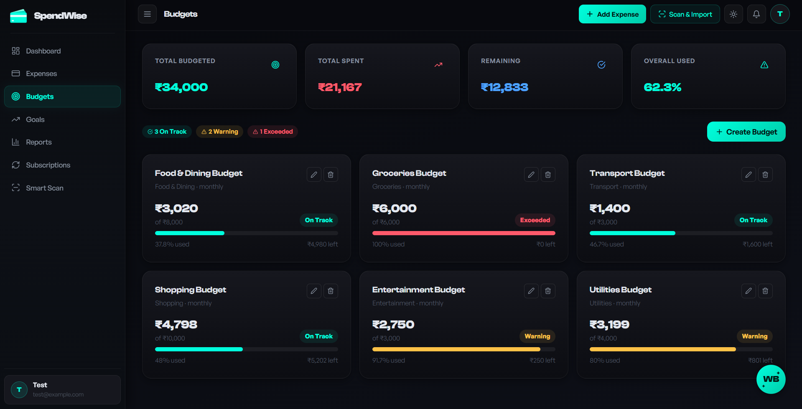
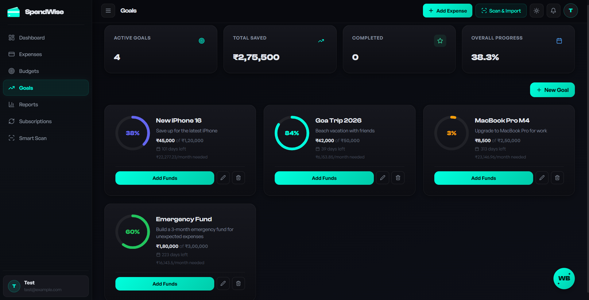
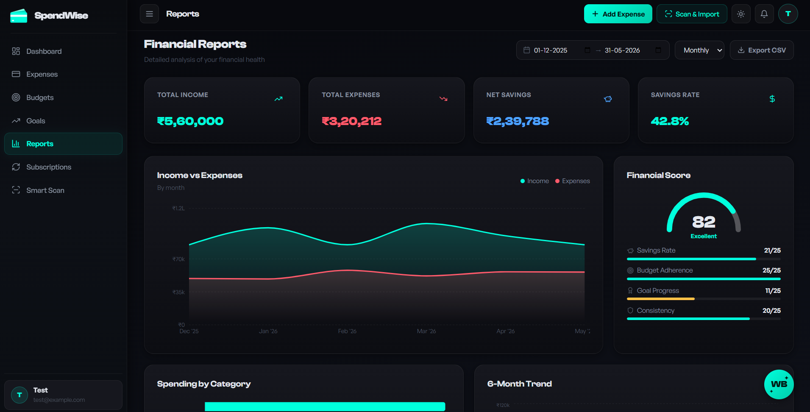
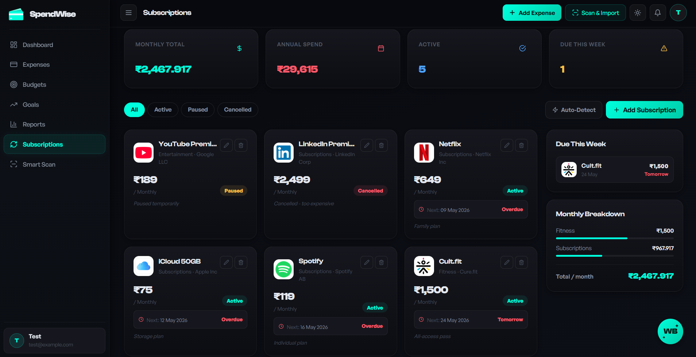
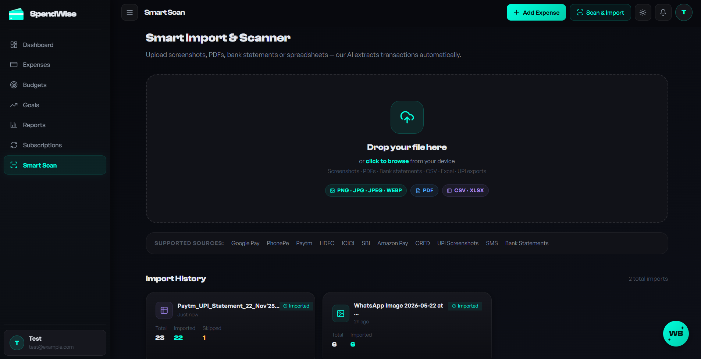
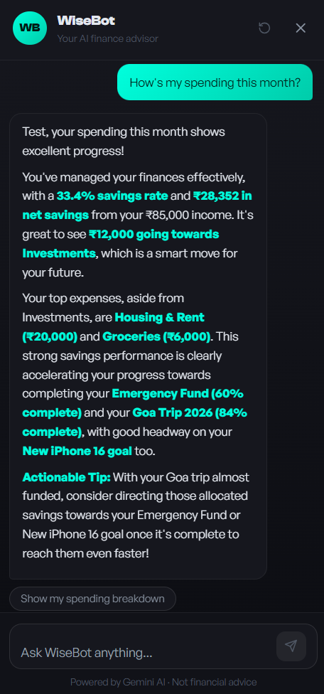

# SpendWise — AI-Powered Personal Finance Intelligence Platform

## Overview

**SpendWise** is a full-stack personal finance management platform that combines expense tracking, budget monitoring, subscription management, savings goals, and AI-powered financial intelligence in one unified application.

Where most finance apps stop at manual entry, SpendWise goes further. The **Smart Scan** system extracts transactions directly from screenshots of UPI apps (Google Pay, PhonePe, Paytm), bank statements, PDFs, CSV exports, and Excel spreadsheets — turning a photo into a structured financial record in seconds.

**WiseBot**, the built-in AI financial assistant powered by Google Gemini 2.5 Flash, provides context-aware financial insights, spending pattern analysis, and proactive insights based on the user's actual transaction history. The platform also computes a real-time **Financial Health Score** (0–100, graded A+ to D) that accounts for savings rate, budget adherence, goal progress, and spending consistency.

---

## Features

| Module | Description |
|---|---|
| **Dashboard** | Real-time financial overview — net balance, monthly KPIs, spending trends, budget health, goal progress, and subscription reminders |
| **Expense Tracking** | Full transaction CRUD with category assignment, merchant tracking, payment method, tags, and advanced search/filter |
| **Budget Management** | Category-level spending limits with configurable alert thresholds and on-track / warning / exceeded status |
| **Savings Goals** | Goal creation with target amounts, deadlines, contribution tracking, and milestone notifications at 25%, 50%, 75%, and 100% |
| **Subscription Tracker** | Manual subscription management + AI-powered auto-detection of recurring charges from expense history |
| **Financial Reports** | Income vs. expense trends, category breakdowns, financial health score with personalized recommendations |
| **Smart Scan** | AI-assisted import of transactions from images (OCR), PDFs, CSV, and XLSX files with duplicate detection and auto-categorization |
| **WiseBot** | Context-aware AI financial assistant with session management, proactive insights, and suggested follow-up prompts |
| **Notifications** | In-app alerts for budget overruns, goal milestones, and upcoming subscription renewals |
| **Profile & Preferences** | Currency selection, dark/light theme, monthly income configuration, and avatar management |

---

## Tech Stack

### Frontend
- **React 18.3.1** — UI framework
- **Vite 5.2** — Build tool and dev server
- **React Router v6** — Client-side routing
- **TanStack React Query v5** — Server state management and caching
- **Tailwind CSS 3.4.4** — Utility-first styling
- **Framer Motion** — Animations and transitions
- **Recharts** — Financial data visualization
- **Axios** — HTTP client with JWT interceptor and auto-refresh
- **Lucide React** — Icon library
- **React Hot Toast** — Toast notifications
- **React Markdown** — Markdown rendering for WiseBot responses

### Backend
- **Flask 3.0.3** — REST API framework
- **Flask-CORS** — Cross-origin resource sharing
- **Flask-JWT-Extended** — JWT authentication (access + refresh tokens)
- **mysql-connector-python** — MySQL database driver with connection pooling
- **bcrypt** — Password hashing

### Database
- **MySQL 8.0** — Primary relational database (11 tables)

### AI & Document Processing
- **Google Gemini 2.5 Flash** — WiseBot chat, import insights, proactive financial tips
- **Pillow** — Image preprocessing for OCR
- **pdfplumber** — PDF table extraction
- **pandas + openpyxl** — CSV and Excel parsing

---

## Screenshots

### Dashboard



<p align="center"><b>Figure 1:</b> Dashboard page showing the central financial overview of the platform.</p>

The Dashboard acts as the primary financial control center of SpendWise. It provides users with an immediate overview of their financial condition through key performance indicators such as **Net Balance**, **Monthly Expenses**, **Income**, and **Financial Score**.

The page also includes:

- Spending trend visualization for daily financial movement analysis
- Top category distribution chart for identifying major spending areas
- Budget health monitoring section
- Recent transaction preview
- Savings goal progress overview
- Subscription reminders and insights
- Quick access to WiseBot AI assistant

The purpose of this page is to give users a complete snapshot of their financial status without navigating to individual modules.

---

### Expense Management



<p align="center"><b>Figure 2:</b> Expense tracking module with transaction management and category analytics.</p>

The Expenses module manages all income and expense transactions within the system.

Features visible in this section include:

- KPI cards displaying total expenditure, transaction count, category dominance and average transaction value
- Advanced filtering system using categories, transaction type and date range
- Search functionality for locating transactions quickly
- Manual expense entry support through **Add Expense**
- Direct import capability through **Scan & Import**
- Transaction table containing merchant information, category, payment method and amount
- Category-wise spending visualization

This module serves as the primary transaction management layer where financial records are created, categorized and maintained.

---

### Budget Management



<p align="center"><b>Figure 3:</b> Budget management system with category-wise allocation tracking.</p>

The Budgets module allows users to create category-specific financial limits and monitor expenditure against allocated amounts.

Each budget card contains:

- Allocated amount
- Current expenditure
- Remaining balance
- Percentage utilization
- Visual progress indicators
- Status classification:
  - On Track
  - Warning
  - Exceeded

The module helps users control overspending while maintaining planned allocations.

---

### Savings Goals



<p align="center"><b>Figure 4:</b> Goal management module with savings progress tracking.</p>

The Goals section enables users to create and manage financial targets.

Examples visible in the interface include:

- New iPhone purchase goal
- Goa Trip fund
- Emergency fund
- MacBook purchase goal

Each goal provides:

- Circular progress visualization
- Saved amount tracking
- Remaining target amount
- Deadline calculation
- Monthly contribution requirement
- Fund addition support

The module promotes long-term financial planning and milestone achievement.

---

### Financial Reports



<p align="center"><b>Figure 5:</b> Financial analytics and reporting dashboard.</p>

The Reports module provides analytical insights into user finances.

The page includes:

- Income vs expense trend analysis
- Savings rate calculation
- Net savings computation
- Financial score evaluation
- Category expenditure breakdown
- Historical trend tracking
- Time range filtering support
- CSV export functionality

This section transforms raw financial records into actionable insights.

---

### Subscription Tracker



<p align="center"><b>Figure 6:</b> Subscription management and recurring expense monitoring system.</p>

The Subscription module tracks recurring payments and digital services.

Visible examples include:

- YouTube Premium
- Netflix
- Spotify
- iCloud
- LinkedIn Premium
- Cult.fit

Features include:

- Monthly and annual expenditure tracking
- Renewal reminders
- Active / Paused / Cancelled states
- Due alerts
- Monthly breakdown analytics
- Auto detection of recurring subscriptions

This module prevents unnoticed recurring expenses.

---

### Smart Scan — AI Transaction Import



<p align="center"><b>Figure 7:</b> Smart Scan interface for importing and extracting transactions from screenshots, PDFs, spreadsheets and bank statements.</p>

Smart Scan reduces manual data entry by extracting transactions directly from external financial sources.

Supported inputs:

- UPI screenshots
- Google Pay exports
- PhonePe screenshots
- Paytm statements
- Bank statements
- PDFs
- CSV files
- Excel spreadsheets

Capabilities include:

- OCR extraction
- Transaction detection
- Auto categorization
- Duplicate prevention
- Import history tracking
- Batch transaction insertion

This module acts as the automated ingestion engine of SpendWise.

---

### WiseBot — AI Financial Assistant



<p align="center"><b>Figure 8:</b> WiseBot conversational financial intelligence assistant.</p>

WiseBot is the AI assistant integrated throughout SpendWise and powered by Google Gemini.

WiseBot utilizes transaction history, budgets, goals, reports and spending behaviour patterns to generate personalized financial intelligence.

Capabilities visible in the interface include:

- Monthly spending analysis
- Savings rate evaluation
- Net savings insights
- Goal progress monitoring
- Expense category interpretation
- Actionable recommendations
- Context-aware financial conversations
- Suggested follow-up prompts

WiseBot operates using actual transaction history, budgets, goals and reports data to provide personalized financial intelligence.

---

## Project Structure

```text
SpendWise/
├── backend/
│   ├── app.py                  # Flask app factory and blueprint registration
│   ├── config.py               # Environment config (DB, JWT, file uploads, CORS)
│   ├── database.py             # MySQL connection pool and schema initialization
│   ├── requirements.txt        # Python dependencies
│   ├── seed_data.py            # Default category seeding
│   ├── routes/
│   │   ├── auth.py             # /api/auth — register, login, refresh, profile
│   │   ├── expenses.py         # /api/expenses — transaction CRUD, stats, categories
│   │   ├── budgets.py          # /api/budgets — budget CRUD with spending tracking
│   │   ├── goals.py            # /api/goals — savings goals and contributions
│   │   ├── subscriptions.py    # /api/subscriptions — subscription tracking and detection
│   │   ├── dashboard.py        # /api/dashboard — financial summary and KPIs
│   │   ├── reports.py          # /api/reports — trends, category analysis, financial score
│   │   ├── wisebot.py          # /api/wisebot — AI chat, insights, history
│   │   ├── imports.py          # /api/imports — file scan, preview, confirm
│   │   └── notifications.py    # /api/notifications — alerts management
│   ├── services/
│   │   ├── ai_service.py       # Gemini API integration (WiseBot, insights, import analysis)
│   │   ├── categorizer.py      # Keyword-based auto-categorization with confidence scoring
│   │   ├── import_service.py   # CSV, XLSX, PDF, and image parsing pipelines
│   │   └── ocr_service.py      # OCR for receipts and screenshots
│   └── uploads/                # Uploaded file storage
│
├── frontend/
│   ├── src/
│   │   ├── pages/
│   │   │   ├── Auth/           # Login and signup
│   │   │   ├── Dashboard/      # Financial overview
│   │   │   ├── Expenses/       # Transaction management
│   │   │   ├── Budgets/        # Budget creation and tracking
│   │   │   ├── Goals/          # Savings goals
│   │   │   ├── Subscriptions/  # Recurring payments
│   │   │   ├── Reports/        # Analytics and financial score
│   │   │   ├── Import/         # Smart Scan file import
│   │   │   ├── Profile/        # User profile settings
│   │   │   ├── Preferences/    # App preferences
│   │   │   ├── Landing/        # Public landing page
│   │   │   └── WiseBot/        # AI financial assistant chat
│   │   ├── components/         # Shared UI components
│   │   ├── context/            # React contexts (Auth, Theme)
│   │   ├── api/                # Axios instance with JWT interceptor
│   │   └── index.css           # Tailwind base + custom design tokens
│   ├── package.json
│   └── vite.config.js
│
├── screenshots/                # README screenshots
├── .env                        # Environment variables (not committed)
├── start-backend.bat           # Windows: start Flask API
├── start-frontend.bat          # Windows: start Vite dev server
├── start-all.bat               # Windows: start both concurrently
└── README.md
```

---

## Getting Started

### Prerequisites

Ensure the following are installed before setup:

- **Node.js** 18+ and npm
- **Python** 3.10+
- **MySQL** 8.0+
- A **Google Gemini API key** — obtain one from [Google AI Studio](https://aistudio.google.com/)

---

### 1. Clone the Repository

```bash
git clone https://github.com/Srajan-V-N/SpendWise.git
cd SpendWise
```

---

### 2. Configure Environment Variables

Create a `.env` file in the `backend/` directory:

```env
# Flask
FLASK_SECRET_KEY=your_flask_secret_key_here
JWT_SECRET_KEY=your_jwt_secret_key_here

# MySQL
MYSQL_HOST=localhost
MYSQL_PORT=3306
MYSQL_USER=root
MYSQL_PASSWORD=your_mysql_password
MYSQL_DB=SpendWise

# CORS (adjust if your frontend runs on a different port)
CORS_ORIGINS=http://localhost:5173,http://localhost:5174

# Google Gemini
GEMINI_API_KEY=your_gemini_api_key_here
```

---

### 3. Set Up the Database

Log into MySQL and create the database:

```sql
CREATE DATABASE SpendWise;
```

The database schema and default category seeds are applied automatically on first backend startup.

---

### 4. Backend Setup

```bash
cd backend
pip install -r requirements.txt
python app.py
```

The Flask API will start on `http://localhost:5000`.

---

### 5. Frontend Setup

Open a new terminal window:

```bash
cd frontend
npm install
npm run dev
```

The React app will start on `http://localhost:5173`.

---

### Windows Quick Start

If you are on Windows, use the provided batch files from the project root to start both services at once:

```bat
start-all.bat
```

Or start them separately:

```bat
start-backend.bat
start-frontend.bat
```

---

## API Overview

All endpoints are prefixed with `/api` and return JSON. Authentication uses `Authorization: Bearer <access_token>` headers.

| Blueprint | Prefix | Responsibility |
|---|---|---|
| Auth | `/api/auth` | Registration, login, token refresh, profile management |
| Dashboard | `/api/dashboard` | Monthly financial summary, KPIs, trends |
| Expenses | `/api/expenses` | Transaction CRUD, filtering, statistics, category listing |
| Budgets | `/api/budgets` | Budget creation, spending tracking, alert thresholds |
| Goals | `/api/goals` | Savings goal management, contributions, milestone tracking |
| Subscriptions | `/api/subscriptions` | Subscription CRUD, auto-detection from expense patterns |
| Reports | `/api/reports` | Trend analysis, category breakdown, financial health score |
| Imports | `/api/imports` | File scan (CSV/XLSX/PDF/image), preview, confirm import |
| WiseBot | `/api/wisebot` | AI chat, proactive insights, conversation history |
| Notifications | `/api/notifications` | Alert listing, read/unread management |

**Health check:** `GET /api/health`

---

## Key Technical Details

- **Authentication:** JWT with 1-hour access tokens and 30-day refresh tokens; passwords hashed with bcrypt
- **Duplicate detection:** SHA256 hash of `(user_id, date, amount, title)` prevents importing the same transaction twice
- **Auto-categorization:** Keyword-based matching against 20+ categories (Zomato → Food, Uber → Transport, Netflix → Entertainment) with confidence scoring; user corrections are stored in a merchant alias table and applied to future imports
- **Subscription detection:** Analyzes 6 months of expense history for recurring patterns (minimum 2 occurrences, confidence threshold 0.7)
- **Financial Health Score:** Composite 0–100 score — savings rate (25 pts), budget adherence (25 pts), goal progress (25 pts), spending consistency (20 pts) — with letter grade A+ through D
- **OCR pipeline:** Images sent to Gemini Vision API for transaction extraction; PDFs processed with pdfplumber with OCR fallback via Pillow

---

## Future Enhancements

- Investment portfolio tracking
- Predictive spending forecasting engine
- Multi-user / family shared accounts and budgets
- Banking API integration for automatic transaction sync
- Mobile app (iOS / Android)
- Export center — PDF and Excel report downloads

---

## Author

**Srajan V N**  
[GitHub](https://github.com/Srajan-V-N)
